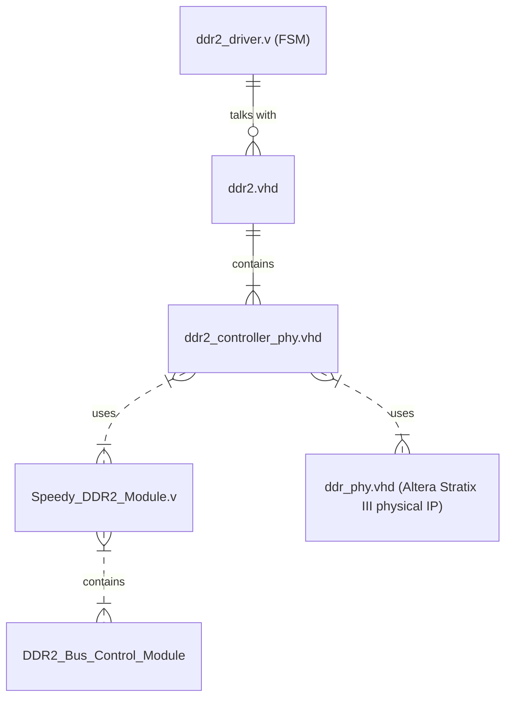

# DDR2 Controller Trial

* This code is tested on the Stratix III 3SL150 Development Board.
* Constraint files are not included in this repository.
* This trial is based on the [Microsoft Speedy DDR2 Module](https://www.microsoft.com/en-us/research/wp-content/uploads/2016/02/The20Speedy20DDR220Controller20For20FPGAs20ERSA20200920Final.pdf) and is strictly for non-commercial use. 
* I have customised the original code for compatibility with the Altera FPGA, as the original design was specifically made for Xilinx.
* This design does not employ Xilinx MIG IP or the Altera DDR Memory Controller IP. 
* You will gain a comprehensive understanding of FPGA DDR architecture timings, which are essential for latency-critical designs.
* To integrate this code with your application, you may only need to modify the file "ddr2_driver.v." if you want to upload on 3SL150 Development Board.
* Below is a hierarchical diagram that clearly illustrates the relationships between the modules.

